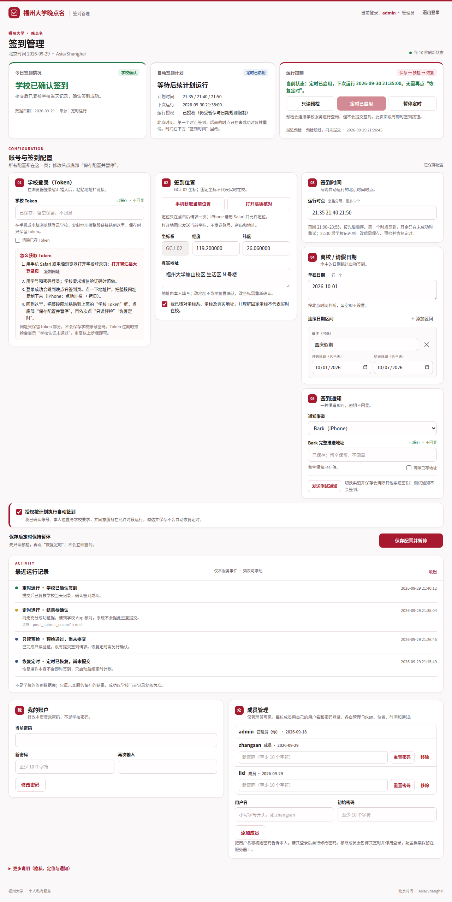
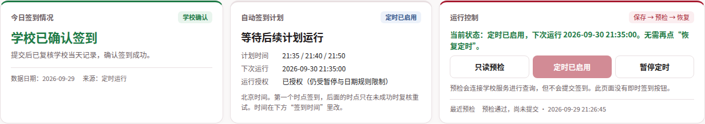
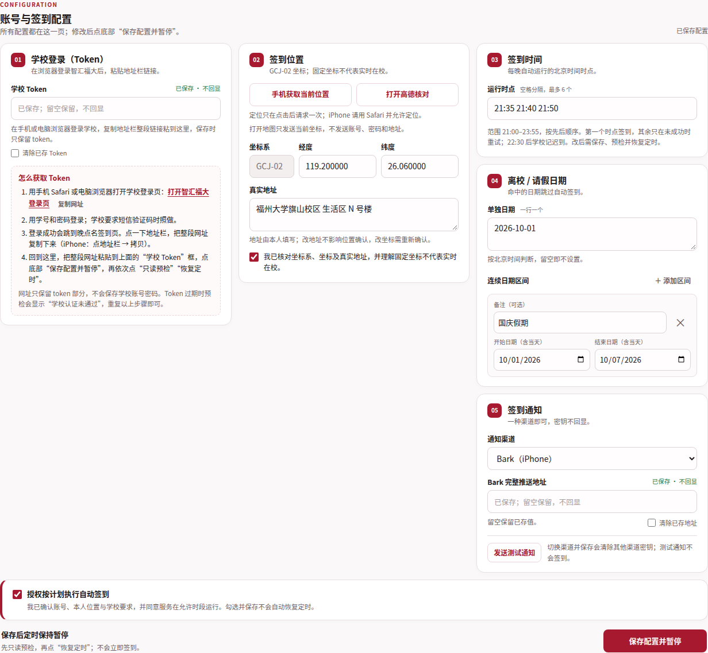
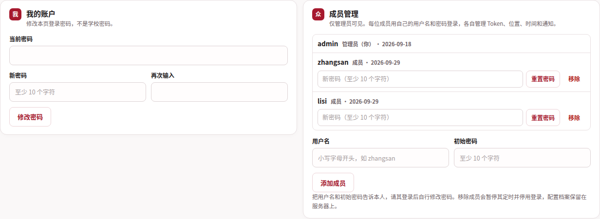
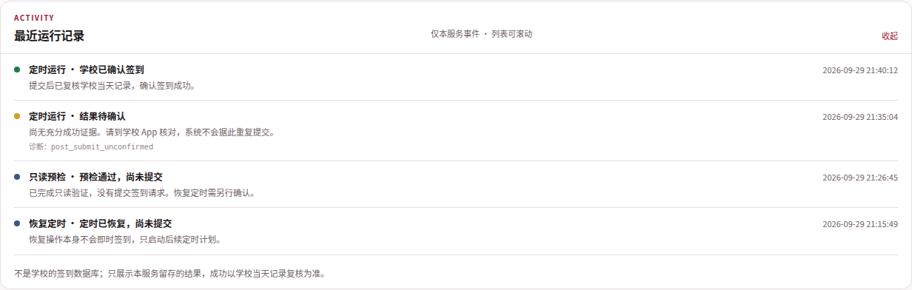
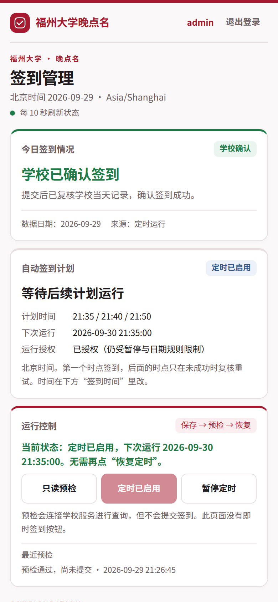
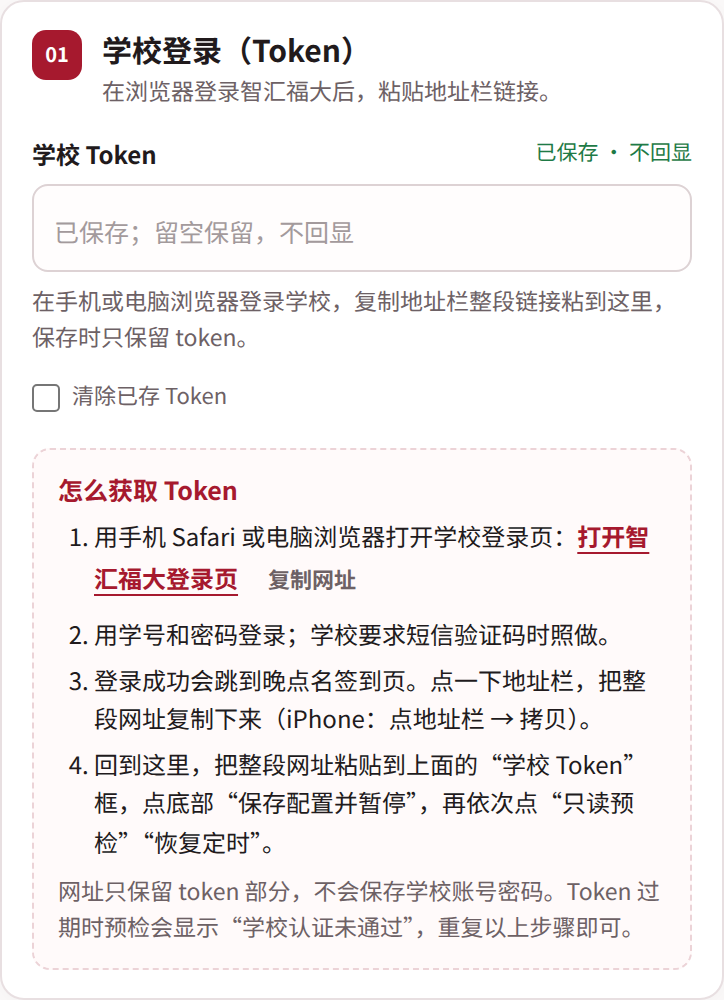

# fzu-checkin

福州大学「智汇福大」晚点名自动签到，服务器多用户版。

[](https://github.com/Wei-l-w/fzu-checkin/actions/workflows/tests.yml)


在自己的服务器上常驻运行，用手机网页管理，每晚按计划完成签到；只有在学校当天记录里复核到成功，才会判定为成功。

<p align="center"></p>

## 功能

- **定时签到**：systemd 定时，默认 21:35 / 21:40 / 21:50（北京时间），可在页面修改；后续时点只在未成功时复核重试。
- **网页管理**：学校 Token、签到坐标（手机定位 + 高德核对）、签到时间、离校/请假日期、通知渠道；只读预检、暂停、恢复。
- **多用户**：管理员创建成员账户，每人独立档案、独立定时、独立记录。
- **Token 登录**：不保存学号密码；Token 过期时页面提示，重新粘贴链接即可。
- **结果核验**：日期、身份、计划、时段、校区范围全部通过才提交一次；提交后复查学校记录；当天确认后不再运行。
- **通知**：Bark、Server酱、企业微信。
- **安全**：签到进程以非特权用户运行；root 控制代理只接受固定动作；私有目录 0700；CSRF 与 Origin 校验；页面没有“立即签到”按钮。

## 界面

<table>
  <tr>
    <td width="50%"><br><sub>今日情况 · 自动签到计划 · 运行控制（只高亮当前状态）</sub></td>
    <td width="50%"><br><sub>Token、位置、签到时间、请假日期、通知，一页配置</sub></td>
  </tr>
  <tr>
    <td width="50%"><br><sub>我的账户 · 成员管理（仅管理员可见）</sub></td>
    <td width="50%"><br><sub>运行记录：可折叠、固定高度滚动，区分学校确认与待确认</sub></td>
  </tr>
</table>

<p align="center">
  &nbsp;&nbsp;
  
</p>

## 工作原理

1. 成员在自己的浏览器登录智汇福大（学校要求短信验证码时照做），把跳转后的地址栏链接粘贴到管理页，服务只保留其中的 `token`。
2. 每晚定时：读取档案 → 只读查询学校当天任务、时段和校区范围 → 全部满足才提交一次 → 复查学校记录（学校异步入库，最多复查 4 次）→ 记录结果并推送通知。
3. 验证码、人脸、二次验证由本人在官方 App 或浏览器完成，本项目不做任何绕过。

## 部署

本项目在一台普通的 Linux 云服务器上运行（作者即如此部署）。需要：带 systemd 的 Linux、Python 3.11+、一个带 HTTPS 的域名。管理页只占一个路径前缀，可以挂在现有站点下。

```bash
git clone https://github.com/Wei-l-w/fzu-checkin.git
cd fzu-checkin
sudo deploy/install.sh --origin https://your.domain --base-path /fzu
```

安装脚本会创建系统用户 `fzu-checkin`、安装到 `/opt/fzu-checkin`、准备虚拟环境与数据目录 `/var/lib/fzu-checkin`、渲染并启用 systemd 单元、安装 `fzu-checkinctl`，最后交互式创建管理员账户（默认用户名 `admin`）。

在反向代理里把 `/fzu/*` 转发到 `127.0.0.1:18779`（端口可用 `--port` 修改）：

```caddyfile
your.domain {
    handle /fzu* {
        reverse_proxy 127.0.0.1:18779
    }
}
```

```nginx
location /fzu/ {
    proxy_pass http://127.0.0.1:18779;
    proxy_set_header Host $host;
}
```

## 使用流程

1. 管理员在「成员管理」里填写用户名和初始密码，告知成员；成员登录后在「我的账户」修改密码。
2. 按页面「怎么获取 Token」的说明，在浏览器登录学校并粘贴地址栏链接。
3. 填写签到坐标（可手机定位后打开高德核对）和真实地址，勾选本人确认；按需设置签到时间、请假日期和通知。
4. 勾选「授权按计划执行自动签到」→「保存配置并暂停」→「只读预检」→「恢复定时」。

之后每晚自动运行，结果显示在「今日签到情况」，第一晚建议再到学校 App 核对一次。

## 运维

| 命令 | 作用 |
| --- | --- |
| `sudo fzu-checkinctl status [用户名]` | 查看档案的定时与配置状态（缺省 `admin`） |
| `sudo fzu-checkinctl preflight [用户名]` | 只读预检，不提交 |
| `sudo fzu-checkinctl pause \| resume [用户名]` | 暂停 / 预检通过后恢复定时 |
| `sudo fzu-checkinctl logs [用户名]` | 查看该档案最近日志 |
| `sudo fzu-checkinctl user-list \| user-add \| user-password \| user-remove <用户名>` | 本地管理账户（密码隐藏输入） |

- 私有数据全部在 `/var/lib/fzu-checkin/`：`profiles/<用户名>/` 是各人的配置与记录，`users/users.json` 是账户。备份即打包此目录。
- 升级：`git pull` 后重新执行 `sudo deploy/install.sh --origin ...`（数据不会被覆盖）。
- 移除成员会暂停其定时、停用登录，配置档案改名保留。

## 安全与隐私

- Token 与推送密钥保存在 0600 的私有文件里，页面不回显；不保存学号密码。
- 不向第三方上传数据；「打开高德核对」只发送当前坐标，不带账号与地址。
- 登录全局限流 10 次 / 10 分钟；会话 8 小时上限、30 分钟闲置过期；管理员重置密码会立即使对方会话失效。
- 协议核查与 fail-closed 规则见 [docs/PROTOCOL_REVIEW.md](docs/PROTOCOL_REVIEW.md)、[docs/protocol.md](docs/protocol.md)；历史部署记录见 [docs/history/](docs/history/)。

## 限制与声明

- 固定坐标不能证明本人实时在校。请只在符合学校要求时启用，离校及时暂停；使用后果由使用者自行承担。
- 不支持自动完成验证码、人脸或短信验证；Token 有效期由学校决定。
- 学校接口字段格式来自真实观测，学校改版后可能需要调整；遇到未知格式时程序会停在“待确认”而不是猜测。
- 仅供个人学习与使用，请遵守学校相关规定。

## 开发

```bash
python3 -m venv venv && venv/bin/pip install -r requirements.lock
venv/bin/python -m unittest discover -s tests -p 'test_*.py'   # 全部离线
node --test tests/test_location.cjs                               # 坐标换算
node --test tests/location_browser.cjs                            # 需要 playwright-core 与 Chromium
```

`main.py` 签到流程 · `src/` 配置、学校接口、登录态、通知、后端 · `admin_server.py` 管理页服务 · `admin_static/` 前端 · `control_broker.py` root 控制代理 · `deploy/` 安装脚本与 systemd 单元 · `tests/` 离线测试

## 致谢与许可

基于 [cccccheyu/fzu-auto-checkin](https://github.com/cccccheyu/fzu-auto-checkin) 的接口逆向与最初实现重写。[MIT License](LICENSE)。
